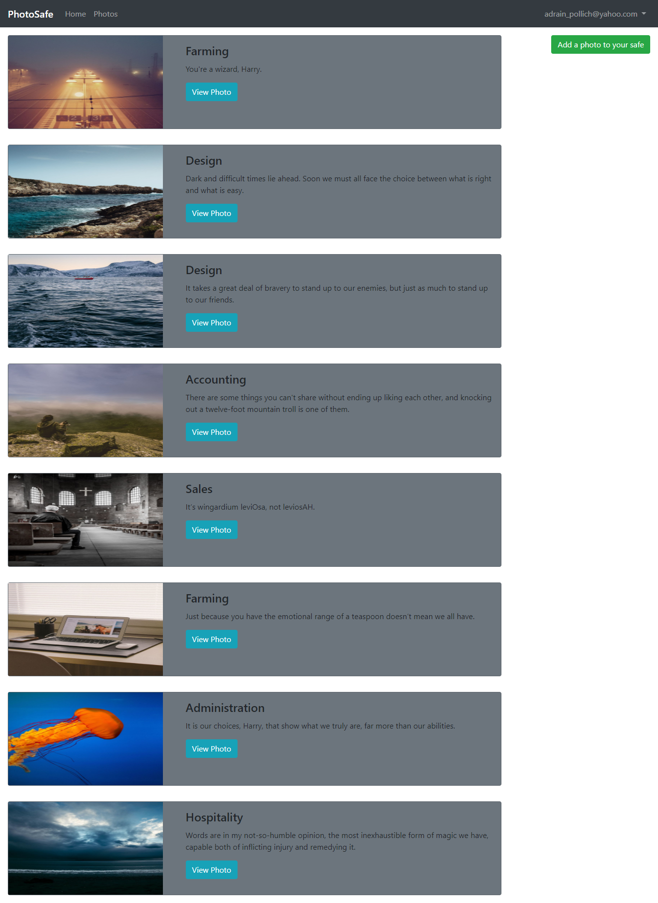

# Photo Safe

With phone camera technology improving with every new release, we are taking more and more photos. The focus has always been on the social aspect of these photos, Instagram, Facebook, Twitter. 

However, what if you are a gas engineer, a property manager, or like me, you tend to take photos of important content such as confidential letters? 

We require a safe place to keep these important photos, not just on our mobile phones.

The Photo Safe application allows you to sign in securely and manage all your important photos in one secure place, so you never have to worry about them falling into the wrong hands, being deleted or getting lost.

[Visit Site](https://gga-photo-safe.herokuapp.com/ )

## Usage

1. Fork and clone the repo: `git clone https://github.com/samibirnbaum/GGA-Photo-Safe.git`
2. You must have Ruby installed (built using version 2.4.1)
3. Run `$ bundle install` to download/install the needed dependencies
4. Start the local server: `$ rails s`.
5. Open a web browser and go to `http://localhost:3000`.

HuBoard (project manager tool I use for my GitHub issues relating to the project): https://huboard.com/samibirnbaum/GGA-Photo-Safe#/milestones

